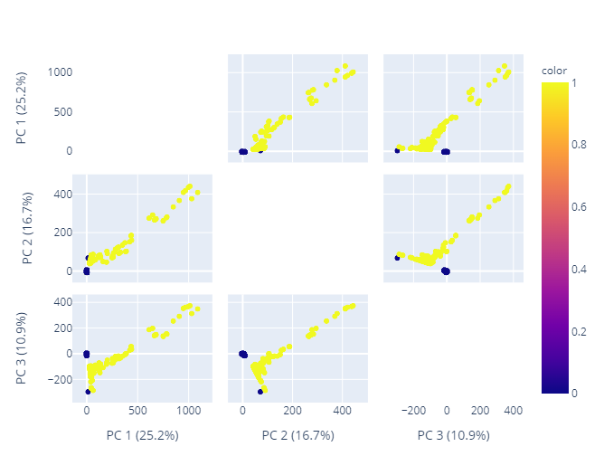

# ml_for_scientificanalysis
1. **task_classification**
The dataset is designed to detect intrusions into the IoT network environment. [data](https://www.kaggle.com/datasets/azalhowaide/iot-dataset-for-intrusion-detection-systems-ids) The predicted value is the type of network traffic, so it's a classification problem.
- EDA
- PREPROCESSING
- MODEL

 
